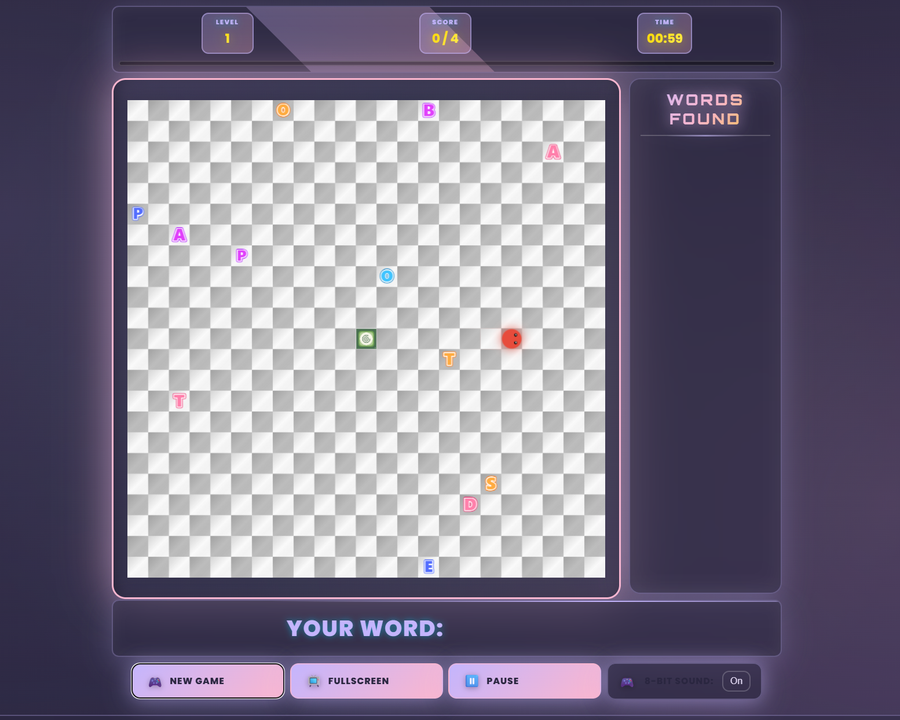

# 🐍 Snake Word Hunt

**[Play in Browser](https://MesutKaval.github.io/Snake-Word-Hunt/)** 🚀

A modern, fast-paced web game that combines the thrill of the classic Snake game with word puzzle strategy.

## 🎮 How to Play

Control the snake to collect letters and build valid English words!
- **Movement**: Arrow Keys (⬅️⬆️⬇️➡️) or W, A, S, D
- **Submit Word**: When you've collected letters, enter the **Center Portal** (the green area in the middle) to submit your word.
- **Level Up**: Reach the target score to complete the level. Press **Space** to advance to the next level.

## 🌟 Game Features

*   **10 Levels**: Progressively harder levels. The snake speeds up and the target score increases each level.
*   **Dynamic Word Validation**: 350,000+ word English dictionary.
*   **Penalty System**: Submit an invalid word and "Wall Portals" will appear on the map!
*   **Visual & Sound Effects**: 8-bit retro sounds, particle effects, and neon graphics.

## 🌀 Portal Guide

The game features special portals with strategic importance:

| Icon | Name | Description |
| :---: | --- | --- |
|  | **Center Portal** | Enter here to submit your word. The heart of the game. |
|  | **Undo Portal** | Appears when you find a **5-letter** word. Removes the last letter from your snake's tail. Reappears when conditions are met again. |
|  | **Time Portal** | Appears on **6+ letter** words. Adds **+30 seconds** to your timer. Reappears when conditions are met again. |
|  | **x2 Score Portal** | Appears on **7+ letter** words. Submit a valid word through this portal to earn **double points**. |
|  | **Level Skip Portal** | Appears on **8+ letter** words. Enter this portal to **skip directly to the next level**. |
|  | **Wall (Penalty) Portal** | Appears as punishment for submitting an invalid word. If the snake hits this wall, **GAME OVER**. |

> **Note:** Undo, Time, x2, and Level Skip portals can only exist one at a time on the map. Unused portals carry over to the next level.

## 🚀 How to Run

### Option 1: Play Online (Recommended)
Click the link below to play without downloading anything:
👉 **[https://MesutKaval.github.io/Snake-Word-Hunt/](https://MesutKaval.github.io/Snake-Word-Hunt/)**

### Option 2: Run Locally
To play offline:
1.  Download this repository.
2.  Double-click `start_game.bat`. (Python must be installed on your computer)

## 🛠️ Technologies

*   HTML5 Canvas
*   Vanilla JavaScript (ES6+)
*   CSS3 (Modern Design)

## 📄 License

This game was designed by **Mesut Kaval**, with AI tools used during the coding process. It is open source and free to use.
